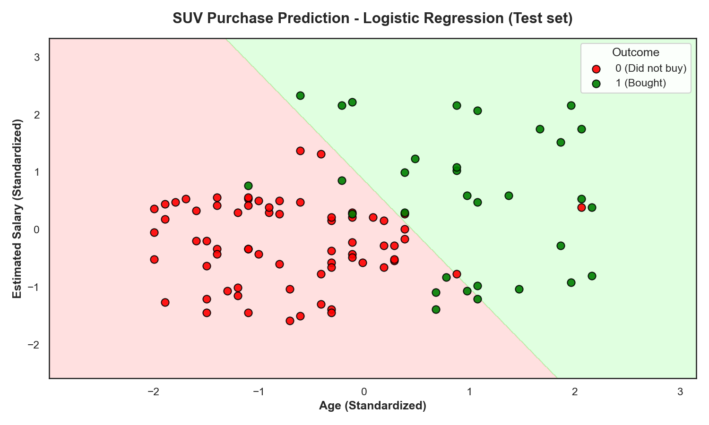
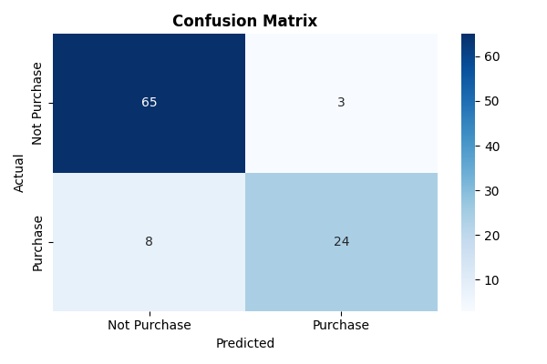

# Logistic Regression: Complete Theory and Project Implementation

## Overview

Logistic regression is a fundamental machine learning method used for binary classification. It helps predict one of two possible outcomes, such as yes or no, true or false, or 0 and 1. Even though the word "regression" appears in its name, it is mainly used for classification problems because it predicts probabilities rather than exact numeric values.

It is commonly applied in areas like medical diagnosis, spam detection, customer behavior prediction, and loan approval prediction.

## Why It Is Used

A normal linear regression model is not suitable for binary classification because it can produce values below 0 or above 1, which do not make sense for probabilities.

Logistic regression solves this problem by converting the output into a probability between 0 and 1 using the sigmoid function.

## How It Works

### Linear Combination

Logistic regression first combines the input features into a linear expression:

```
z = w₁x₁ + w₂x₂ + ... + wₙxₙ + b
```

Where:
- x₁, x₂, …, xₙ are the input features
- w₁, w₂, …, wₙ are the weights
- b is the bias term

### Sigmoid Function

The value z is then passed through the sigmoid function:

```
σ(z) = 1 / (1 + e^(−z))
```

This function converts any real number into a value between 0 and 1.

****
*Figure: The sigmoid function squashing values from -∞ to +∞ into the range [0,1]*

### Probability and Prediction

The model estimates probability using the equation:

```
P(y = 1 | X) = 1 / (1 + e^(−(wᵀX + b)))
```

If the probability is greater than a threshold (usually 0.5), the model predicts class 1. Otherwise, it predicts class 0.

This simple rule makes logistic regression easy to understand and interpret.

## Log-Odds

Logistic regression is based on the concept of odds and log-odds.

Odds are written as:
```
p / (1 − p)
```

Log-odds (also called the logit) are written as:
```
log(p / (1 − p))
```

The model assumes that the log-odds are a linear combination of the input features. This is a key idea behind logistic regression.

## Training Process

During training, the model learns the best values for the weights and bias. It compares predicted probabilities with actual class labels and tries to reduce the error.

### Loss Function

The loss function commonly used is binary cross-entropy:

```
J = −(1/m) Σ [ yᵢ log(ŷᵢ) + (1 − yᵢ) log(1 − ŷᵢ) ]
```

Where:
- m is the number of samples
- yᵢ is the actual label
- ŷᵢ is the predicted probability

### Optimization

The optimization process adjusts the parameters to minimize this loss using gradient descent or other optimization algorithms.

## Decision Boundary

Logistic regression creates a decision boundary between two classes. In a 2D dataset, this boundary appears as a straight line on a scatter plot.

Points on one side of the boundary are classified as class 0, while points on the other side are classified as class 1.

****
*Figure: Decision boundary separating purchase (green) and no purchase (red) classes*

This makes it easy to visualize how the model separates different classes.

## Assumptions

Logistic regression works best under the following assumptions:

1. **Binary Target**: The target variable is binary
2. **Independence**: Observations are independent
3. **No Multicollinearity**: Input features are not highly correlated
4. **Linearity**: There is a linear relationship between features and log-odds
5. **No Extreme Outliers**: Extreme outliers are limited

## Advantages

Logistic regression is widely used because:

- **Simplicity**: It is simple and easy to understand
- **Probabilistic Output**: It provides probability outputs
- **Binary Classification**: It works well for binary classification problems
- **Speed**: It is fast to train
- **Visualization**: It is easy to visualize in lower dimensions
- **Interpretability**: Coefficients can be interpreted as odds ratios

Because of these strengths, it is often used as a baseline model for classification tasks.

## Limitations

Despite its advantages, logistic regression has some limitations:

- **Complexity**: It may not perform well on complex datasets
- **Non-linearity**: It struggles with non-linear relationships
- **Outliers**: It can be sensitive to outliers
- **Preprocessing**: It may require proper feature scaling and preprocessing
- **Multi-class**: Requires extensions for multi-class problems

---

# Project Implementation: Social Ads Classification

## Dataset Description

This project uses a synthetic dataset of social media advertisements to predict whether a user will purchase a product based on their demographic information.

**Dataset Features:**
- **Age**: User's age (years)
- **EstimatedSalary**: User's estimated annual salary (currency units)
- **Purchased**: Binary target (0 = No Purchase, 1 = Purchase)

## Exploratory Data Analysis

### Class Distribution

Understanding the balance between classes is crucial for classification tasks.

### Feature Statistics

Statistical summary of the features helps understand the data characteristics.

### Correlation Analysis

Examining relationships between features and the target variable.

## Data Preprocessing

### Feature Scaling

Standard scaling is essential because features are on different scales:

```
z = (x - mean) / std_dev
```

### Train-Test Split

The dataset is typically split using a 75/25 ratio to ensure proper model evaluation.

## Model Training

### Learning Algorithm

The model learns optimal weights using gradient descent to minimize the binary cross-entropy loss.

### Convergence Monitoring

Training progress is monitored to ensure the model converges properly.

## Model Evaluation

### Confusion Matrix

The confusion matrix provides detailed performance analysis:

****
*Figure: Confusion matrix showing model predictions vs actual values*

### Performance Metrics

Key metrics for evaluating the model:

- **Accuracy**: Overall correctness
- **Precision**: Proportion of positive predictions that are correct
- **Recall**: Proportion of actual positives that are correctly identified
- **F1-Score**: Harmonic mean of precision and recall

### ROC Curve

Receiver Operating Characteristic curve shows the trade-off between true positive rate and false positive rate.

## Decision Boundary Visualization

### 2D Decision Boundary

In the feature space (Age vs Salary), the decision boundary separates the two classes.

### Probability Contours

The model outputs probabilities that can be visualized as contours.

## Model Interpretation

### Coefficient Analysis

The learned coefficients can be interpreted as the importance of each feature.

### Odds Ratios

Coefficients can be converted to odds ratios for easier interpretation.

## Practical Applications

### Real-World Scenarios

This type of model can be applied to:

- **Marketing Campaigns**: Target users likely to convert
- **Product Recommendations**: Suggest products to interested users
- **Customer Segmentation**: Group users by purchase likelihood
- **Budget Optimization**: Allocate marketing resources efficiently

### Business Impact

Understanding the business value of the model predictions.

## Limitations and Extensions

### Current Limitations

- **Binary Classification**: Only handles two classes
- **Linear Decision Boundary**: Cannot capture complex patterns
- **Feature Engineering**: Requires manual feature selection

### Possible Extensions

- **Polynomial Features**: Capture non-linear relationships
- **Regularization**: Prevent overfitting (L1, L2)
- **Multi-class**: Extend to multiple categories
- **Ensemble Methods**: Combine with other models

## Conclusion

Logistic regression remains a fundamental and powerful tool for binary classification tasks. Despite its simplicity, it provides interpretable results and serves as an excellent baseline model. This project demonstrates its practical application in marketing and user behavior prediction.

**Key Takeaways:**
1. **Interpretability**: Easy to understand and explain
2. **Efficiency**: Fast to train and predict
3. **Probabilistic**: Provides confidence scores
4. **Baseline**: Excellent starting point for classification problems

---

## References and Further Reading

1. Hosmer, D. W., Lemeshow, S., & Sturdivant, R. X. (2013). Applied Logistic Regression.
2. James, G., Witten, D., Hastie, T., & Tibshirani, R. (2013). An Introduction to Statistical Learning.
3. Bishop, C. M. (2006). Pattern Recognition and Machine Learning.
